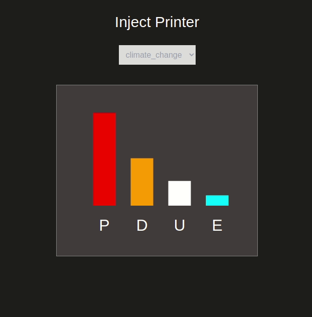

# Coding challenge 

## Impact graphs



```javascript
{
  name: "Inkjet Printer",
  impacts: {
    climate_change: {
      production: 45,
      distribution: 23,
      use: 12,
      end_of_life: 5
    },
    energy_use: {
      production: 32,
      distribution: 5,
      use: 28,
      end_of_life: 1
    }
  }
}
```

## Live Demo

- [production](https://trusting-bassi-4903cc.netlify.app/)

## Built With

```sh
Front-End(client)
```

- HTML + CSS
- HTML SVG
- JavaScript
- Stimulusjs
- Tailwindcss

```sh
Testing Frameworks
```
- Jest

## Getting Started

To get a local copy up and running follow these simple example steps.

### Prerequisites

- Node

- Basic knowledge of npm/yarn

### Installation

1. Clone the repo

```sh
git clone https://github.com/Cyrus-Kiprop/html_coding_challenge.git
```

2. CD into the project root directory

```sh
cd ./html_coding_challenge
```

3. Install Dependencies and packages

```sh
yarn install
```

4. start the app locally

```sh
yarn start
```
## Run Test Cases
```sh
yarn jest
```

<!-- USAGE EXAMPLES -->

## Usage

### Navigate to your browser and open port 9000 (use your live server port):

```JS
http//localhost:9000
```

## Authors

👤 **Cyrus Kiprop**

- Github: [Cyrus-Kiprop](https://github.com/Cyrus-Kiprop)
- Twitter: [@kipropJS](https://twitter.com/kipropJS)
- Linkedin: [Cyrus Kiprop](https://www.linkedin.com/in/cyrus-kiprop-ba7320120/)


## Show your support

Give a ⭐️ if you like this project!

## Acknowledgments

- Project requested by EarthSter Team.

